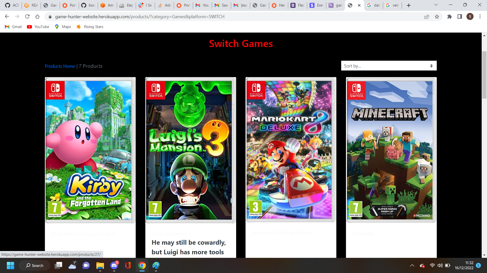

# Game Hunter

Game hunter is a UK website focused on selling and delivering games, consoles and accessories to online users, exclusively within the UK. 

# Motivation

My motivation for this project was my love of all things gaming. I wanted to deliver an intuitive website that is dedicated to UK customers and provides a great service with an easy to use website.    

# Table of contents
1. [Project Description](#project-description)
    1. [UX Design](#ux-design)
    2. [Navigation](#navigation)
    3. [Landing Page](#landing-page)
    4. [My Profile](#my-profile)
    5. [Sign Up](#sign-up)
    6. [Log In](#log-in)
    7. [Log Out](#log-out)
    8. [All Products](#all-products)
    9. [Games](#games)
       1. [All Games](#all-games)
       2. [PS4](#ps4-games)
       3. [PS5](#ps5-games)
       4. [Xbox One](#xbox-one-games)
       5. [Xbox Series X](#xbox-series-x-games)
       6. [Switch](#switch-games)
   10. [Consoles](#consoles)
       1. [All Consoles](#all-consoles)
       2. [PS4](#ps4-consoles)
       3. [PS5](#ps5-consoles)
       4. [Xbox One](#xbox-one-consoles)
       5. [Xbox Series X](#xbox-series-x-consoles)
       6. [Switch](#switch-consoles)
   11. [Accessories](#accessories)
       1. [All Accessories](#all-accessories)
       2. [PS4](#ps4-accessories)
       3. [PS5](#ps5-accessories)
       4. [Xbox One](#xbox-one-accessories)
       5. [Xbox Series X](#xbox-series-x-accessories)
       6. [Switch](#switch-accessories)
    12. [Reviews](#reviews)
    13. [Footer](#footer)
    14. [Feedback](#feedback)
    15. [Product Detail](#product-detail)
    16. [Loot](#loot)
    17. [Check Out](#check-out)
    18. [Add, edit and delete products](#add-edit-and-delete-products)
    19. [Error 404](#error-404)
    20. [Responsive Design](#responsive-design)
2. [Data Schema](#data-schema)
3. [Technologies Used](#technologies-used)
4. [Facebook Page](#facebook-page)
5. [Development](#development)
6. [Deployment](#deployment)
7. [Tests](#tests)
8. [Validators](#validators)
9. [Bugs & Solutions](#bugs-&-solutions)
10. [Updates](#updates)
11. [Credits](#credits)

## Project Description 
 
Game Hunter is B2C online store designed to sell games, console and accessories withing the UK. The store is designed to be easily accessable to users and provide customers with a reliable and affordable products.
 

## UX Design 
 
The user experience is designed to be simple and easy to use. I used a black and white colour theme with hints of grey to keep text easy to read and stylish. 
 
 
My project uses a simple, easy to follow layout with drop down links that takes the user to the selected category.
This allows for very easy navigation. The user can easily find a product using the search bar or by selecting the category.
Purchases are made easy using stripe and take a few minutes.
 
 
An admin user is able to add, edit and delete products from the UI with no need to go to the Django admin panel and normal users are able to leave reviews. 
 
 
Below are handrawn wireframes illustrating the basic layout of the website. 
 
 

 
 

 
 

 

- Navigation 

Navigating the website is done using two Nav-bars and a serach bar. The first contains the brand, "home", "my account" and loot links. 
 
 
The "brand" when  clicked will bring the user to the home page. 

The "home" link which will also bring the user to the home page.

The "my account" link which drops down to reveal log in and sign up links if the user is not logged in. If the user is logged in
then the users name folled by "profile" link will be displayed and will take the user to their profile page.
If the user is a superuser then the add product link will also display for the user to add new products to the store. 

The "loot" links are the current amount of the items in the bag and a chest symbol, both will take the user to the bag page.

 

The second Nav-bar contains the "all products", "games", "consoles" and "accessories" links. 

The "all products" link allows the user to view every product, in all categories.

The "games" link is a drop down link containing "all games", "PS4", "PS5", "XBOX ONE", "XBOX SERIES X" and switch links.
Each link will take the user to the selected category. 

The console and accessories links function the same way as the "games" link.

 
 
The search bar can be used to find specific items, across all categories. The user simply types what they are looking for 
and if it matches a product then it will be displayed. 
 
 

- Landing Page 
   
   
  The landing page is simple, it shows the user a gaming themed picture, the nav-bars, footer and review section. 
  This makes it immediately obvious to the user what the site is selling. 
   
   
  
   
   
  
  

- My Profile 
   
   
  The profile page allows the user to see and save their shipping details for faster checking out and also shows all previous 
  orders the user has made. 
   
   
  
  

- Sign Up 
   
   
  The sign up page askes the user to provide an email address, username and password. Once all have been entered a verification 
  email is sent to the users provided email with a verification link, once the link is clicked the user is verified and can sign in. 
   
   
  
   
   
  If the user tries to sign in without verifying they are taken to the verify your email page.
   
   
  
  

- Log In 

  The log in page askes the user to fill in their username or email and password. Once the information is provided
  the user is logged in and taken to the home page. 
   
   
  
  

- Log Out 
  
  The log out page askes the user if they want to log out and will only log the user out once the "log out" button is pressed.
   
   
  
  

- All Products 
  
  The all products page allows the user to view every product on the store and the sort box allows the user to sort products by price (low to high) or (high to low)
  or name (A to Z) or (Z to A).
   
   
  
   
   
  
  

- Games 

  The games link is a drop down link that contains all the links to take the user to the category they select. 

   
  
   
   

    - All Games
       
       
      The all games page allows the user to browse every game, on every platform. 
       
       
      
      

       
    - PS4 Games
       
       
      The PS4 games page shows only PS4 games to the user.
       
       
      
      

       
    - PS5 Games
       
       
      The PS5 games page shows only PS5 games to the user.
       
       
      
      

       
    - Xbox One Games
       
       
      The Xbox One games page shows only Xbox One games to the user.
       
       
      
      

       
    - Xbox Series X Games
       
       
      The Xbox Series X games page shows only Xbox Series X games to the user.
       
       
      
      

       
    - Switch Games
       
       
      The Switch games page shows only Switch games to the user.
       
       
      
      

       

- Consoles 
  
  The consoles link is a drop down link that contains all the links to take the user to the category they select. 

   
  
   
   
    
    - All Consoles 
       
       
      The all consoles page allows the user to browse every console. 
       
       
      
      

       
    - PS4 Consoles
       
       
      The PS4 consoles page allows the user to browse every PS4 console. 
       
       
      
      

       
    - PS5 Consoles
       
       
      The PS5 consoles page allows the user to browse every PS5 console. 
       
       
      
      

       
    - Xbox One Consoles
       
       
      The Xbox One consoles page allows the user to browse every Xbox One console. 
       
       
      
      

       
    - Xbox Series X Consoles
       
       
      The Xbox Series X consoles page allows the user to browse every Xbox Series X console. 
       
       
      
      

       
    - Switch Consoles
       
       
      The Switch consoles page allows the user to browse every Switch console. 
       
       
      
      

       

- Accessories 

  The accessories link is a drop down link that contains all the links to take the user to the category they select. 

   
  
   
   

    - All Accessories
       
       
      The all accessories page allows the user to browse every accessory. 
       
       
      
      

       
    - PS4 Accessories
       
       
      The PS4 accessories page allows the user to browse every PS4 accessory. 
       
       
      
      

       
    - PS5 Accessories
       
       
      The PS5 accessories page allows the user to browse every PS5 accessory. 
       
       
      
      

       
    - Xbox One Accessories
       
       
      The Xbox One accessories page allows the user to browse every Xbox One accessory. 
       
       
      
      

       
    - Xbox Series X Accessories
       
       
      The Xbox Series X accessories page allows the user to browse every Xbox Series X accessory. 
       
       
      
      

       
    - Switch Accessories
       
       
      The Switch accessories page allows the user to browse every Switch accessory. 
       
       
      
      

       

- Reviews 
  
  The reviews section is part of the home page will display the 8 most recent reviews that users leave.
   
  If the user is not logged in or signed up then the section will ask the user to log in or sign up, with the relevent links.
   
   
  
   
   
  If the user is logged in then the add review link will be displayed.
   
   
  
   
   
  Once the add review link is clicked the user will be taken to the add review page where they can enter their review.
   
   
  
   
   
  Once the review is complete the user is taken to the add review success page and given a link to return to the home page.
   
   
  
   
   
  The review is then displayed with the options to edit or delete the review if the user that is logged in is the one who posted it.
   
   
  
   
   
  If the edit review link is clicked the user is taken to the edit review page. The user can edit the review or cancel and be taken back to the home page. 
   
   
  
   
   
  If the delete review link is clicked the user is taken to the delete review confirmation page. The user can delete the review or cancel and be taken back to the home page.
   
   
  
   
  

- Footer 
   
  The footer contains social links, privacy policy link and the option for a user to subscribe. The social links have been removed because the pages they link to do not currently exists. If the site goes into real world use then the social links will be added with the code below. 
   
  <!-- Section: Social media -->
      <section class="mb-4">
        <!-- Facebook -->
        <a class="btn btn-outline-light btn-floating m-1" href="#!" rel="noopener">
          <i class="fab fa-facebook"></i>
        </a>

        <!-- Twitter -->
        <a class="btn btn-outline-light btn-floating m-1" href="#!" rel="noopener" role="button"><i
            class="fab fa-twitter"></i></a>

        <!-- Google -->
        <a class="btn btn-outline-light btn-floating m-1" href="#!" rel="noopener" role="button"><i
            class="fab fa-google"></i></a>

        <!-- Instagram -->
        <a class="btn btn-outline-light btn-floating m-1" href="#!" rel="noopener" role="button"><i
            class="fab fa-instagram"></i></a>

        <!-- Linkedin -->
        <a class="btn btn-outline-light btn-floating m-1" href="#!" rel="noopener" role="button"><i
            class="fab fa-linkedin"></i></a>
      </section>
<!-- Section: Social media -->
   
   
  
   
   
  The footer out of production currently looks like the image below.
   
   
  
   
  

- Feedback 
   
   
  The user can get to the feedback page from the checkout success page and it is an optional link. 
   
   
  
   
   
  Once the user is on the feedback page they can choose to rate the website, checkout and delivery time. 
   
   
  
   
   
  Once the user has submitted their feedback they are taken to the feedback success page and are given a link to return to the home page. 
   
   
  
   
  

- Product Detail 
   
   
  Once the user has selected a product, they are taken to the product detail page and given the option to change the quantity and can add it to their loot bag. 
  They are also given a link to return to the product page.
   
   
  
   
  

- Loot 
   
   
  Once the user has selected submit from the product detail page, they are taken to the loot page. 
  Here the user can remove the item from their loot, update the quantity, go back to the product page or securely checkout. 
   
   
  
   
  

- Check Out 
   
   
  Once the user has selected the secure checkout link they are taken to the checkout page.
  Here the user is asked to enter their details, delivery information and card details. 
   
   
  If the user is not looged in they are asked to log in or create an account to save their information.
   
   
  If the user is logged in they have the option to save their delivery information for faster checking out. 
   
   
  
   
   
  
   
   
  
   
  

- Add, edit and delete products 
   
   
  If the user is a superuser they can access the add product page through the "my account" link in the top nav-bar.
   
   
  If the user is not a superuser they will not see this link and trying to access it through the direct url will direct the user to the log in page. 
   
   
  
   
   
  
   
   
  Once a product has been added it can be edited or deleted from the product page or from the product detail page.
   
   
  If the user is not a superuser and tries to access the edit or delete page from the url then they are taken to the log in page.
   
   
  
   
   
  
   
   
  When a superuser selects one of the edit links they are taken to the edit product page and they are able to edit all of the fields they entered when adding the product, or cancel and be taken back to the home page. 
   
   
  
   
   
  
   
   
  When a superuser selects one of the delete links they are taken to the delete product confirmation page and asked if they are sure they want to delete the product or cancel and be taken back to the products page. If the delete button is clicked then the product is deleted.
   
   
  If a normal user tries to access the delete product page from the url they are taken to the log in page. 
   
   
  
   
  

- Error 404 
   
   
  If a user tries to access a url that is not part of the website they are taken to the error 404 page.
   
   
  
   
  

- Responsive Design 
   
   
  The website responds to large, medium and small screen sizes by shrinking the top navbar to a burger button and by stacking the second navbar vertically.
   
   
  The products are dispalyed in rows of 4 on large screens, rows of 3 on medium screens and and a single row on samll screens.
   
   
  The product detail page stacks vertically on small screens. 
   
   
  Below are images of the responsive design as Heroku will not allow the app to connect to a "am I responsive website."
   
   
  
   
   
  
   
   
  
   
   
  
   
   
  
   
  

## Data Schema 
   
   
  Below shows how the models correlate to each other and what is contained within each model and what type of field is used.  
   
   
  
   
  

## Technologies Used 
  For this project the main technologies used were Python, Django, Bootstraps. 
  Python was used as it is required for Django and Django was used to save time when creating databases, authorization, tests, ect. 
  AWS was used to store static files and images when the website is deployed on Heroku, as Heroku will delete images when the dynos are reset. 
  Bootstraps was used to enable easy editing of html and css elements so the wesite could be developed faster. 
  
  Along with the above technologies many python modules were installed, the full list can be seen below:

  - asgiref==3.5.2
  - backports.zoneinfo==0.2.1
  - boto3==1.26.21
  - botocore==1.29.21
  - dj-database-url==0.5.0
  - Django==4.1.2
  - django-allauth==0.51.0
  - django-crispy-forms==1.14.0
  - django-storages==1.13.1
  - fontawesomefree==6.2.0
  - gunicorn==20.1.0
  - jmespath==1.0.1
  - oauthlib==3.2.2
  - Pillow==9.3.0
  - psycopg2==2.9.5
  - PyJWT==2.6.0
  - python3-openid==3.2.0
  - requests-oauthlib==1.3.1
  - s3transfer==0.6.0
  - sqlparse==0.4.3
  - stripe==5.0.0
  - whitenoise==6.2.0
   
  

## Facebook Page 
   
   
  A Facebook business page was set up for this project and then delete, as to not have a "fake" Facebook business page.
  The page will be created again if the project goes into real world use. 
   
   
  The page can be seen below.
   
   
  
   
   
  
   
   
  

## Development 
   
   
  Game Hunter was developed using agile methodology and completed in two iterations.
  A kanban board was used to keep track of user stories and each user story detailed a different function. 
   
   
  Iteration 1 dealt with the core structure of the website, such as basic file structure, html and css elements. 
   
   
  Iteration 2 dealt with all other aspects of the website, such as functionality.
   
   
  The user stories and kanban board can be seen in the images below.
   
   
  
   
   
  
   
   
  
   
   
  
   
   
  
   
   
  
   
   
  
   
   
  
   
   
  
   
  

## Deployment 
  
  The Game Hunter website was deployed on Heroku using the following steps:
  
  1.  I prepared Procfile
  2.  I created the game-hunter game hunter on Heroku 
  4.  I installed dj_database_url and psycopg2 in my project
  5.  I used pip freeze > requirements.txt to place all installed packages in the requirements.txt folder
  6.  I imported dj_database_url to settings.py
  7.  I configured the database in settings.py to use the dj_database
  8.  I made migrations using python3 manage.py makemigrations and python3 manage.py migrate 
  9.  I created a database on Elephantsql
  10.  I created a bucket on AWS to hold stiticfiles with groups, policies and users
  11.  I created a stripe account for payments. 
  12.  I added AWS_ACCESS_KEY, AWS_SECRET_ACCESS_KEY, DATABASE_URL, DISABLE_COLLECTSTATIC, EMAIL_HOST_PASS,
      EMAIL_HOST_USER, HEROKU_POSTGRESQL_IVORY_URL, SECRET_KEY, STRIPE_PUBLIC_KEY, STRIPE_SECRET_KEY,
      STRIPE_WH_SECRET, USE_AWS to my Heroku config vars. 
  13.  I configured my settings.py to include all keys from env.py
  14.  On the Heroku website I then navigated to the deployment tab and connect my Github repository to Heroku 
  15.  I allowed automatic commits so that Heroku would always have the current version of my app 
  16. Then I successfully deployed my app using the deploy branch button. 

## Tests 

- Functional testing 
   
   
  Authentication Tests
   
   
  Description: 

  Makes sure a user can sign up to the website.

  Steps:

  1. Navigate to [game-hunter](https://game-hunter-website.herokuapp.com/) and click on the sign up link in the my account dropdown menu.
  2. Enter email twice, username and password twice.
  3. Click Sign up.
  4. Receive verification email and follow link.
  5. click on the verify and be taken to the log in page
   
   
  Expected:
   
   
  The users is able to create the account and their username is displayed in the my account dropdown menu.
   
   
  Actual: 
   
   
  The users is able to create the account and their username is displayed in the my account dropdown menu.
   
   

  Description: 

  Makes sure a user can log in once they are signed up.

  Steps:
   
   
  1. Navigate to [game-hunter](https://game-hunter-website.herokuapp.com/) and click on the log in link in the my account dropdown menu.
  2. Enter username and password.
  3. Click log in.
   
   
  Expected:
   
   
  The user to be taken to the home page and their username is displayed in the may account dropdown menu.
   
   
  Actual: 
   
   
  The user to be taken to the home page and their username is displayed in the may account dropdown menu.
   
   

  Description: 

  Makes sure a user can view their profile once they are logged in.

  Steps:
   
   
  1. Navigate to [game-hunter](https://game-hunter-website.herokuapp.com/) and click on the log in link in the my account dropdown menu.
  2. Enter username and password.
  3. Click log in.
  4. Navigate to my profile 
   
   
  Expected:
   
   
  Be taken to the users profile page and be abel to view default delivery informstion and order history. 
   
   
  Actual: 
   
   
  Be taken to the users profile page and be abel to view default delivery informstion and order history.
   
   

  Description: 

  Makes sure a user can log out once they are logged in.

  Steps:
   
   
  1. Navigate to [game-hunter](https://game-hunter-website.herokuapp.com/) and click on the log out link.
  2. The user is presented with a question asking if they are sure they wish to log out.
  3. Click the log out button. 
   
   
  Expected: 
   
   
  User is redirected to the home page and user profile name and link no longer visible.
   
   
  Actual:
   
   
  User is redirected to the home page and user profile name and link no longer visible.
   
   

  Description: 

  Makes sure a user can leave a review when logged in.

  Steps:
   
   
  1. Navigate to [game-hunter](https://game-hunter-website.herokuapp.com/) and click on the log in link.
  2. Navigate to the bottom of the home page and click the add review link. 
  3. The user is taken to the add review page and can fill in the add review form. 
   
   
  Expected: 
   
   
  User is able to add a review and see it on the home page.
   
   
  Actual:
   
   
  User is able to add a review and see it on the home page.
   
   

  Description: 

  Makes sure a user can edit and delete only their own reviews when logged in.

  Steps:
   
   
  1. Navigate to [game-hunter](https://game-hunter-website.herokuapp.com/) and click on the log in link.
  2. Navigate to the bottom of the home page and click the edit or delete review link. 
   
   
  Expected: 
   
   
  The user is taken to the edit or delete review page and can edit their reveiw or delete it their review.
   
   
  Actual:
   
   
  The user is taken to the edit or delete review page and can edit their reveiw or delete it their review.
   
   

  Description: 

  Makes sure a user can set default delivery details.

  Steps:
   
   
  1. Navigate to [game-hunter](https://game-hunter-website.herokuapp.com/) and click on the log in link.
  2. Navigate to the my profile link in the my account dropdown menu. 
  3. Fill in default delivery details and click update information.
   
   
  Expected: 
   
   
  Users delivery details are auto completed when making a purchase.
   
   
  Actual:
   
   
  Users delivery details are auto completed when making a purchase.
   
   

  Superuser Tests
   
   
  Description: 
   
   
  Add product link displayed in my accounts dropdown menu when logged in as superuser.

  Steps: 
   
   
  1. Navigate to [game-hunter](https://game-hunter-website.herokuapp.com/) and click on the log in link.
  2. Log in as a superuser.
   
   
  Expected: 
   
   
  Superuser is now able to see the add products link in the navbar.
   
   
  Actual:
   
   
  Superuser is now able to see the add products link in the navbar.
   
    
   
  Description: 

  Add products to store.

  Steps: 
   
    
  1. Navigate to [game-hunter](https://game-hunter-website.herokuapp.com/) and click on the log in link.
  2. Log in as a superuser.
  3. The superuser can now see the add product link in the navbar.
  4. Click the add product link. 
  5. The superuser is taken to a new page with all fields displayed for adding a product.
  6. The superuser fills in all needed fields.
  7. Click the add product button.
  8. The superuser is then taken to the products page and can see the new product.
   
    
  Expected: 
   
    
  The new product is displayed on the products page.
   
    
  Actual:
   
    
  The new product is displayed on the products page.
   
    

  Description: 

  Edit products in store.

  Steps: 
   
    
  1. Navigate to [game-hunter](https://game-hunter-website.herokuapp.com/) and click on the log in link.
  2. Log in as a superuser.
  3. The superuser can now see the edit product link in the products page and product detail page.
  4. Click the edit product link. 
  5. The superuser is taken to the edit page and can edit a product.
  6. The superuser fills in all needed fields.
  7. Click the edit product button.
   
    
  Expected: 
   
    
  The superuser is then taken to the products page and can see the updated product.
   
    
  Actual:
   
    
  The superuser is then taken to the products page and can see the updated product.
   
    

  Description: 

  Delete products in store.

  Steps: 
   
    
  1. Navigate to [game-hunter](https://game-hunter-website.herokuapp.com/) and click on the log in link.
  2. Log in as a superuser.
  3. The superuser can now see the delete product link in the products page and product detail page.
  4. Click the delete product link. 
  5. The superuser is taken to the delete product page and asked if they are sure they want the product to be deleted..
  6. Click the delete product button.
   
    
  Expected: 
   
    
  The product is removed from the store and can no longer be found.
   
    
  Actual:
   
    
  The product is removed from the store and can no longer be found.
   
    

  Functionality Tests
   
   
  Description: 
   
   
  Able to add products to loot.

  Steps: 
   
   
  1. Navigate to [game-hunter](https://game-hunter-website.herokuapp.com/) and click on any of the all products, games, consoles or accessories links.
  2. Click on a product.
  3. click add to loot.
   
   
  Expected: 
   
   
  The product is added to the loot and the total price is updated in the navbar.
   
   
  Actual:
   
   
  The product is added to the loot and the total price is updated in the navbar.
   
    

  Description: 
   
   
  Able to search for products using the search bar.

  Steps: 
   
   
  1. Navigate to [game-hunter](https://game-hunter-website.herokuapp.com/) and click on the search bar.
  2. Type in the name of a product.
   
   
  Expected: 
   
   
  The product that was searched for appears in the product page.
   
   
  Actual:
   
   
  The product that was searched for appears in the product page.
   
    

  Description: 
   
   
  Able to purchase product from the store.

  Steps: 
   
   
  1. Navigate to [game-hunter](https://game-hunter-website.herokuapp.com/) and click on any of the all products, games, consoles or accessories links.
  2. Add a product to loot.
  3. Click the secure checkout button.
  4. fill in the checkout form.
   
   
  Expected: 
   
   
  The checkout success page is displayed, the order is confirmed and the order can be viewed in the user profile.
   
   
  Actual:
   
   
  The checkout success page is displayed, the order is confirmed and the order can be viewed in the user profile.
   
    

  Description: 
   
   
  Able to sort products using the sort function.

  Steps: 
   
   
  1. Navigate to [game-hunter](https://game-hunter-website.herokuapp.com/) and click on any of the all products, games, consoles or accessories links.
  2. Use the sort function.
   
   
  Expected: 
   
   
  The products are sorted by the selected field (A to Z), (Z to A), (Price, Low to High) (price, High to Low).
   
   
  Actual:
   
   
  The products are sorted by the selected field (A to Z), (Z to A), (Price, Low to High) (price, High to Low).
   
    

## Validators 

 - Lighthouse
   
   
  
   
   

 - WC3 CSS
   
   
  
   
   

 - WC3 HTML
   
   
  
   
   

 - PEP8
   
   
  PEP8
  Game Hunter was pep8 validated using gitpods built in pep8 module.
   
   
  The only issues I could not fix were lines being too long. I tried to fix these using "\" syntax but this caused errors.
   
  

## Bugs & Solutions  
 
 
Removing products from loot is currently not displaying toasts.
 
 
Webhooks are currently displaying an unauthorised status code and as a result order confiramtion emails are not being sent, 
because they are handeled by StripeWebhookHandler in webhook_handler.py and the order confirmation email only happens after a successful webhook is received. The toast stating that a order confirmation has been sent is still active. 

 

## Updates 
 
I would like to include a function to estimate the delivery time for customer orders.
 
 
I would also like to add product reviews in a future update.

## Credits 
 
Special thanks to Daisy McGirr for mentoring me throughout this project.
 
 
The background image was taken from
https://arstechnica.com/gaming/2020/12/ars-technicas-best-games-of-2020/
 
 
All product images were taken from https://www.amazon.co.uk/

DO NOT DELETE until project is finished

doc strings for all functions

