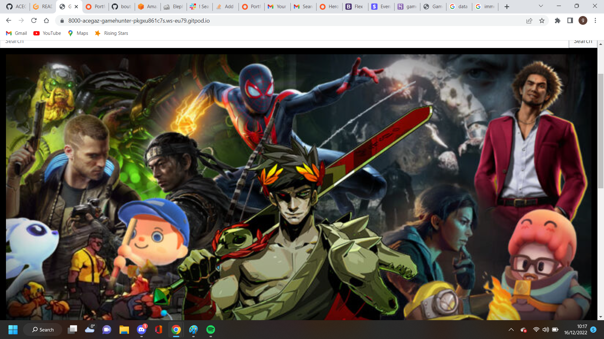

# Game Hunter

Game hunter is a UK website focused on selling and delivering games, consoles and accessories to online users, exclusively within the UK. 

# Motivation

My motivation for this project was my love of all things gaming. I wanted to deliver an intuitive website that is dedicated to UK customers and provides a great service with an easy to use website.    

# Table of contents
1. [Project Description](#project-description)
    1. [Navigation](#navigation)
    2. [Landing Page](#landing-page)
    3. [My Profile](#my-profile)
    4. [Sign Up](#sign-up)
    5. [Log In](#log-in)
    6. [Log Out](#log-out)
    7. [All Products](#all-products)
    8. [Games](#games)
       1. [All Games](#all-games)
       2. [PS4](#ps4)
       3. [PS5](#ps5)
       4. [Xbox One](#xbox-one)
       5. [Xbox Series X](#xbox-series-x)
       6. [Switch](#switch)
    9. [Consoles](#consoles)
       1. [All Consoles](#all-consoles)
       2. [PS4](#ps4)
       3. [PS5](#ps5)
       4. [Xbox One](#xbox-one)
       5. [Xbox Series X](#xbox-series-x)
       6. [Switch](#switch)
   10. [Accessories](#accessories)
       1. [All Accessories](#all-accessories)
       2. [PS4](#ps4)
       3. [PS5](#ps5)
       4. [Xbox One](#xbox-one)
       5. [Xbox Series X](#xbox-series-x)
       6. [Switch](#switch)
    11. [Reviews](#reviews)
    12. [Footer](#footer)
    13. [Feedback](#feedback)
    14. [Check Out](#check-out)
    15. [Add, edit and delete products](#add-edit-and-delete-products)
    16. [Responsive Design](#responsive-design)
2. [Data Schema](#data-schema)
3. [Technologies Used](#technologies-used)
4. [Facebook Page](#facebook-page)
5. [Development](#development)
6. [Deployment](#deployment)
7. [Tests](#tests)
8. [Validators](#validators)
9. [Bugs & Solutions](#bugs-&-solutions)
10. [Updates](#updates)
11. [Credits](#credits)

## Project Description 

My project uses a simple, easy to follow layout with drop down links that takes the user to the selected category.
This allows for very easy navigation. The user can easily find a product using the search bar or by selecting the category.
Purchases are made easy using stripe and take a few minutes.

An admin user is able to add, edit and delete products from the UI with no need to go to the Django admin panel

I decided to go with a black and white colour scheme with a few hints of grey to keep the site easy to read. 
 

- Navigation 

Navigating the website is done using two Nav-bars and a serach bar. The first contains the brand, "home", "my account" and loot links. 
 
 
The "brand" when  clicked will bring the user to the home page. 

The "home" link which will also bring the user to the home page.

The "my account" link which drops down to reveal log in and sign up links if the user is not logged in. If the user is logged in
then the users name folled by "profile" link will be displayed and will take the user to their profile page.
If the user is a superuser then the add product link will also display for the user to add new products to the store. 

The "loot" links are the current amount of the items in the bag and a chest symbol, both will take the user to the bag page.

 

The second Nav-bar contains the "all products", "games", "consoles" and "accessories" links. 

The "all products" link allows the user to view every product, in all categories.

The "games" link is a drop down link containing "all games", "PS4", "PS5", "XBOX ONE", "XBOX SERIES X" and switch links.
Each link will take the user to the selected category. 

The console and accessories links function the same way as the "games" link.

 

The search bar can be used to find specific items, across all categories. The user simply types what they are looking for 
and if it matches a product then it will be displayed. 
 
 

- Landing Page 
 
  The landing page is simple, it shows the user a gaming themed picture, the nav-bars, footer and review section. 
  This makes it immediately obvious to the user what the site is selling. 
   
   
  
   
   
  
  

- My Profile 

  The profile page allows the user to see and save their shipping details for faster checking out and also shows all previous 
  orders the user has made. 
   
   
  
  

- Sign Up 
  
  The sign up page askes the user to provide an email address, username and password. Once all have been entered a verification 
  email is sent to the users provided email with a verification link, once the link is clicked the user is verified and can sign in. 
   
   
  
   
   
  If the user tries to sign in without verifying they are taken to the verify your email page.
   
   
  
  

- Log In 

  The log in page askes the user to fill in their username or email and password. Once the information is provided
  the user is logged in and taken to the home page. 
   
   
  
  

- Log Out 
  
  The log out page askes the user if they want to log out and will only log the user out once the "log out" button is pressed.
   
   
  
  

- All Products 
  
  The all products page allows the user to view every product on the store and the sort box allows the user to sort products by price (low to high) or (high to low)
  or name (A to Z) or (Z to A).
   
   
  
   
   
  
  

- Games 

  The games link is a drop down link that contains all the links to take the user to the category they select. 

   
  
   
   

    - All Games
       
       
      The all games page allows the user to browse every game, on every platform. 
       
       
      
      

       
    - PS4 Games
       
       
      The PS4 games page shows only PS4 games to the user.
       
       
      
      

       
    - PS5 Games
       
       
      The PS5 games page shows only PS5 games to the user.
       
       
      
      

       
    - Xbox One Games
       
       
      The Xbox One games page shows only Xbox One games to the user.
       
       
      
      

       
    - Xbox Series X Games
       
       
      The Xbox Series X games page shows only Xbox Series X games to the user.
       
       
      
      

       
    - Switch Games
       
       
      The Switch games page shows only Switch games to the user.
       
       
      
      

       

- Consoles 
  
  The consoles link is a drop down link that contains all the links to take the user to the category they select. 

   
  
   
   
    
    - All Consoles 
       
       
      The all consoles page allows the user to browse every console. 
       
       
      
      

       
    - PS4 Consoles
       
       
      The PS4 consoles page allows the user to browse every PS4 console. 
       
       
      
      

       
    - PS5 Consoles
       
       
      The PS5 consoles page allows the user to browse every PS5 console. 
       
       
      
      

       
    - Xbox One Consoles
       
       
      The Xbox One consoles page allows the user to browse every Xbox One console. 
       
       
      
      

       
    - Xbox Series X Consoles
       
       
      The Xbox Series X consoles page allows the user to browse every Xbox Series X console. 
       
       
      
      

       
    - Switch Consoles
       
       
      The Switch consoles page allows the user to browse every Switch console. 
       
       
      
      

       

- Accessories 

  The accessories link is a drop down link that contains all the links to take the user to the category they select. 

   
  
   
   

    - All Accessories
       
       
      The all accessories page allows the user to browse every accessory. 
       
       
      
      

       
    - PS4 Accessories
       
       
      The PS4 accessories page allows the user to browse every PS4 accessory. 
       
       
      
      

       
    - PS5 Accessories
       
       
      The PS5 accessories page allows the user to browse every PS5 accessory. 
       
       
      
      

       
    - Xbox One Accessories
       
       
      The Xbox One accessories page allows the user to browse every Xbox One accessory. 
       
       
      
      

       
    - Xbox Series X Accessories
       
       
      The Xbox Series X accessories page allows the user to browse every Xbox Series X accessory. 
       
       
      
      

       
    - Switch Accessories
       
       
      The Switch accessories page allows the user to browse every Switch accessory. 
       
       
      
      

       

- Reviews 

- Footer 

- Feedback 

- Check Out 

- Add, edit and delete products 

- Responsive Design 

    The website responds to large, medium and small screen sizes by shrinking the navbar to a burger button and displaying the 
    comment section in a single column. All elements are sized accordingly using bootstraps containers, rows and column. 

    Below are images of the responsive design as Heroku will not allow the app to connect to a "am I responsive website."

## Data Schema 

## Technologies Used 
  For this project the main technologies used were Python, Django, Bootstraps. 
  Python was used as it is required for Django and Django was used to save time when creating databases, authorization, tests, ect. 
  Cloudinary was used to store static files and images when the website is deployed on Heroku, as Heroku will delete images when the dynos are reset. 
  Bootstraps was used to enable easy editing of html and css elements so the wesite could be developed faster. 
  
  Along with the above technologies many python modules were installed, the full list can be seen below:

  - asgiref==3.5.2
  - backports.zoneinfo==0.2.1
  - boto3==1.26.21
  - botocore==1.29.21
  - dj-database-url==0.5.0
  - Django==4.1.2
  - django-allauth==0.51.0
  - django-crispy-forms==1.14.0
  - django-storages==1.13.1
  - fontawesomefree==6.2.0
  - gunicorn==20.1.0
  - jmespath==1.0.1
  - oauthlib==3.2.2
  - Pillow==9.3.0
  - psycopg2==2.9.5
  - PyJWT==2.6.0
  - python3-openid==3.2.0
  - requests-oauthlib==1.3.1
  - s3transfer==0.6.0
  - sqlparse==0.4.3
  - stripe==5.0.0
  - whitenoise==6.2.0

## Facebook Page 

## Development 

## Deployment 
  
  The Game Hunter website was deployed on Heroku using the following steps:
  
  1.  I prepared Procfile
  2.  I created the app game-hunter on Heroku 
  3.  I navigated to the resources tab and added the Heroku postgres add on pack 
  4.  Then I connected the postgres data base url in my repository
  5.  On the Heroku website I then navigated to the deployment tab and connect my Github repository to Heroku 
  6.  I allowed automatic commits so that Heroku would always have the current version of my app 
  7.  I set up the config vars on the setting tab
  8.  Then I successfully deployed my app using the deploy branch button. 

## Tests 

- Unit Testing 

  Both automated and manual testing has been performed on this projects. 
  
  All automated tests can be found in the tests.py file.
  
  unittest tests simple things like urls being resolved.

  
 

- Functional testing 

  Authentication

  Description: 

  Makes sure a user can sign up to the website

  Steps:

  1. Navigate to [art-by-heart-sketch](https://art-by-heart-sketch.herokuapp.com/) and click on the sign up link.
  2. Enter email(optional), username and password.
  3. Click Sign up.
  
  Expected:

  The users username is displayed in the navbar and they can comment on the gallery page.

  Actual: 

  The users username is displayed in the navbar.

  

  Description: 

  Makes sure a user can log in once they are signed up

  Steps:

  1. Navigate to [art-by-heart-sketch](https://art-by-heart-sketch.herokuapp.com/) and click on the log in link.
  2. Enter username and password.
  3. Click log in.
  
  Expected:

  The user to be taken to the home page and their username to be displayed on the navbar.

  Actual: 

  The user to be taken to the home page and their username to be displayed on the navbar.

  

Description: 

  Makes sure a user can log out once they are logged in.

  Steps: 

  1. Navigate to [art-by-heart-sketch](https://art-by-heart-sketch.herokuapp.com/) and click on the log out link.
  2. The user is presented with a question asking if they are sure they wish to log out.
  3. Click the log out button. 

  Expected: 

  User is redirected to the home page and username no longer visible.

  Actual:

  User is redirected to the home page and username no longer visible.

  

  Description: 

  Upload Artwork link displayed when logged in as superuser.

  Steps: 

  1. Navigate to [art-by-heart-sketch](https://art-by-heart-sketch.herokuapp.com/) and click on the log in link.
  2. Log in as a superuser.
  3. The superuser can now see the upload artwork link in the navbar.

  Expected: 

  Superuser is now able to see the upload artwork link in the navbar.

  Actual:

  Superuser is now able to see the upload artwork link in the navbar.

  
 

   Description: 

   Upload Artwork link allows a superuser to upload new artwork with a title.

  Steps: 

  1. Navigate to [art-by-heart-sketch](https://art-by-heart-sketch.herokuapp.com/) and click on the log in link.
  2. Log in as a superuser.
  3. The superuser can now see the upload artwork link in the navbar.
  4. Click the upload artwork link. 
  5. The superuser is taken to a new page with the title charfield and images selection field.
  6. The superuser types a title and selcts an image from thier files.
  7. Click the upload button.
  8. The superuser is then taken to the gallery page.

  Expected: 

  The title and image that the superuser has selected is displyed on the Gallery page.

  Actual:

  The title and image that the superuser has selected is displyed on the Gallery page.

  

  Description: 

  Able to see add comment link only when logged in.

  Steps: 

  1. Navigate to [art-by-heart-sketch](https://art-by-heart-sketch.herokuapp.com/) and click on the log in link.
  2. Log in.
  3. Navigate to [art-by-heart-sketch](https://art-by-heart-sketch.herokuapp.com/gallery/)
  4. The user is now able to see the add comment button on the gallery page. 

  Expected: 

  User is able to see add comment link.

  Actual:

  User is able to see add comment link.

  

  Description: 

  User is able to add a comment when logged in.

  Steps: 

  1. Navigate to [art-by-heart-sketch](https://art-by-heart-sketch.herokuapp.com/) and click on the log in link.
  2. Log in.
  3. Navigate to [art-by-heart-sketch](https://art-by-heart-sketch.herokuapp.com/gallery/)
  4. The user is now able to add a comment to a piece of uploaded artwork.  

  Expected: 

  User is able to add a comment.

  Actual:

  User is able to add a comment.

  

  Description: 

  User is able to update only their own comments when logged in.

  Steps: 

  1. Navigate to [art-by-heart-sketch](https://art-by-heart-sketch.herokuapp.com/) and click on the log in link.
  2. Log in.
  3. Navigate to [art-by-heart-sketch](https://art-by-heart-sketch.herokuapp.com/gallery/)
  4. The user can now only update comments that they have added.   

  Expected: 

  User is able to update only their own comments.

  Actual:

  User is able to update only their own comments.

  

   Description: 

  User is able to delete only their own comments when logged in.

  Steps: 

  1. Navigate to [art-by-heart-sketch](https://art-by-heart-sketch.herokuapp.com/) and click on the log in link.
  2. Log in.
  3. Navigate to [art-by-heart-sketch](https://art-by-heart-sketch.herokuapp.com/gallery/)
  4. The user can now only delete comments that they have added.   

  Expected: 

  User is able to delete only their own comments.

  Actual:

  User is able to delete only their own comments.

  

   Description: 

  User is able to fill in normal commssion form and see success message.

  Steps: 

  1. Navigate to [art-by-heart-sketch](https://art-by-heart-sketch.herokuapp.com/commissions/).
  2. Fill in the normal commissions form.
  3. Click submit.
  4. The user is shown a success message.

  Expected: 

  User is able to fill in normal commissions form and see success message.

  Actual:

  User is able to fill in normal commissions form and see success message.

  

  Description: 

  User is able to fill in reference sheet form and see success message.

  Steps: 

  1. Navigate to [art-by-heart-sketch](https://art-by-heart-sketch.herokuapp.com/commissions/).
  2. Fill in the reference sheet form.
  3. Click submit.
  4. The user is shown a success message.

  Expected: 

  User is able to fill in reference sheet form and see success message.

  Actual:

  User is able to fill in reference sheet form and see success message.

  

  Description: 

  User is able to fill in the custom form and see success message.

  Steps: 

  1. Navigate to [art-by-heart-sketch](https://art-by-heart-sketch.herokuapp.com/commissions/).
  2. Fill in the custom form.
  3. Click submit.
  4. The user is shown a success message.

  Expected: 

  User is able to fill in the custom form and see success message.

  Actual:

  User is able to fill in the custom form and see success message.

  

  Description: 

  The normal commissions form information is received and read through a gmail account.

  Steps: 

  1. Go to [www.gmail.com](https://mail.google.com/mail/).
  2. Log into account 
  3. View new email to see if the information has been received.

  Expected: 

  All information filled in on normal commissions form appears in email inbox.

  Actual:

  All information filled in on normal commissions form appears in email inbox.

  

  Description: 

  The normal reference sheet form information is received and read through a gmail account.

  Steps: 

  1. Go to [www.gmail.com](https://mail.google.com/mail/).
  2. Log into account 
  3. View new email to see if the information has been received.

  Expected: 

  All information filled in on reference sheet form appears in email inbox.

  Actual:

  All information filled in on reference sheet form appears in email inbox.

  

  Description: 

  The normal custom form information is received and read through a gmail account.

  Steps: 

  1. Go to [www.gmail.com](https://mail.google.com/mail/).
  2. Log into account 
  3. View new email to see if the information has been received.

  Expected: 

  All information filled in on custom form appears in email inbox.

  Actual:

  All information filled in on custom form appears in email inbox.

## Validators 

### Lighthouse

### WC3 CSS

### WC3 HTML

### PEP8

## Bugs & Solutions  

## Updates 

## Credits 

Special thanks to Daisy McGirr for mentoring me throughout this project.

DO NOT DELETE

background image source
https://arstechnica.com/gaming/2020/12/ars-technicas-best-games-of-2020/

removing products from bag not displaying toasts 

Webhooks not working (401 (Unauthorized))

update button on bag not working

<!-- Section: Social media -->
      <section class="mb-4">
        <!-- Facebook -->
        <a class="btn btn-outline-light btn-floating m-1" href="#!">
          <i class="fab fa-facebook"></i>
        </a>

        <!-- Twitter -->
        <a class="btn btn-outline-light btn-floating m-1" href="#!" rel="noopener" role="button"><i
            class="fab fa-twitter"></i></a>

        <!-- Google -->
        <a class="btn btn-outline-light btn-floating m-1" href="#!" rel="noopener" role="button"><i
            class="fab fa-google"></i></a>

        <!-- Instagram -->
        <a class="btn btn-outline-light btn-floating m-1" href="#!" rel="noopener" role="button"><i
            class="fab fa-instagram"></i></a>

        <!-- Linkedin -->
        <a class="btn btn-outline-light btn-floating m-1" href="#!" rel="noopener" role="button"><i
            class="fab fa-linkedin"></i></a>

        <!-- Github -->
        <a class="btn btn-outline-light btn-floating m-1" href="#!" rel="noopener" role="button"><i
            class="fab fa-github"></i></a>
      </section>
      <!-- Section: Social media -->